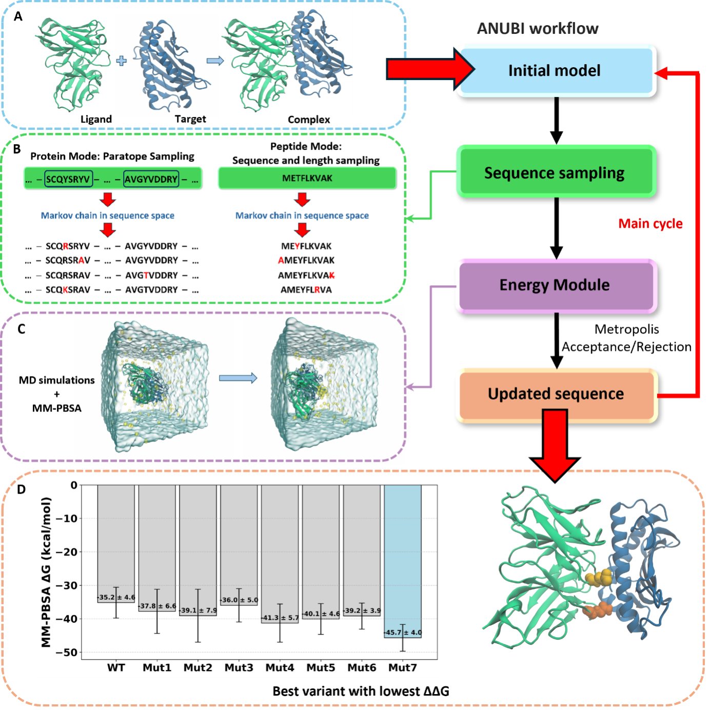

# ANUBI
Version: 1.0.0  

---
## **Article**
If you use ANUBI in your pipeline, please cite the following article:  
  
**ANUBI: A Platform for Affinity Optimization of Proteins and Peptides in Drug Design**  
Damiano Buratto, Wanding Wang, Xinyi Zhang, Qiujie Zhu, Jia Meng, Daniel J. Rigden, Ruhong Zhou, and Francesco Zonta  
Journal of Chemical Theory and Computation Article ASAP  
DOI: 10.1021/acs.jctc.5c01640  

## **Overview**
This software is designed to **optimize protein or peptide candidates for improved target binding**. 
### **The whole process includes**  
**1. The initial MD：Make topology, Build box, Add water and ions, Energy minimization, NVT and NTP;**   
**2. The production MD;**  
**3. Binding free energy calculation: gmx_MMPBSA;**  
**4. Sequence Sampling using Monte Carlo methods: We have two different modes PEPTIDE MODE and PROTEIN MODE**  



---

## **Installation**
### **Dependencies**
- **GROMACS** (GPU version)
- **gmx_MMPBSA**: https://valdes-tresanco-ms.github.io/gmx_MMPBSA/dev/installation/  (**MPI error: gmx_mpi and mpirun(MMPBSA) conflict, check MMPBSA version**.)  
- **Modeller**: https://salilab.org/modeller/download_installation.html  (**You need licence for that**.)      
- **Other dependencies**: Pandas, Numpy, pyyaml, biopython if you don't have them, please use conda to install (or other ways you prefer) 


### **Installation Steps**
1. Clone the repository:
   ```bash
   git clone https://github.com/ZontaLab/ANUBI.git
   cd ANUBI
2. Make sure you have all dependencies: check conda, python, gromacs, gmx_mmpbsa and modeller;
   ```bash
   conda env create -f gmx_MMPBSA_env.yml        **Installing gromacs-2024.3-cuda, gmx_MMPBSA, vmd, pdbfixer and modeller**
   conda activate gromacs
3. Open the input file **input.yaml**, change parameters: **input setting, IMPORTANT Basic setting, gmx_mmpbsa, Modeller and run**. You need to set the input file path, different mode (peptide or protein), conda activation path, etc., as well as the number of chains, mutation locations, etc., based on your own requirements, you can check the **ANUBI_USER_GUIDE.pdf** for detailed information (**PLease make sure your paths for running GROMACS and gmx_MMPBSA are correct**).   
4. When you make sure that all dependencies and setting are ok, run main script:
   ```bash
   python ANUBI_main.py -i infile.yaml
   
## License

This software is licensed under the GNU Affero General Public License v3.0 (AGPL-3.0) with the Commons Clause Condition v1.0.

- **Free for academic, research, and personal use**
- **Commercial use requires a license**
- **For commercial licensing:** Contact francesco.zonta@xjtlu.edu.cn
